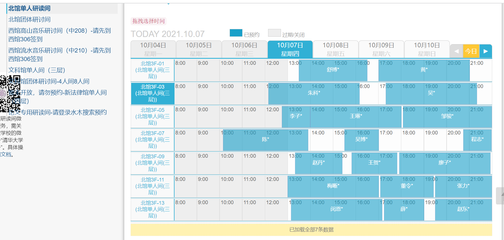
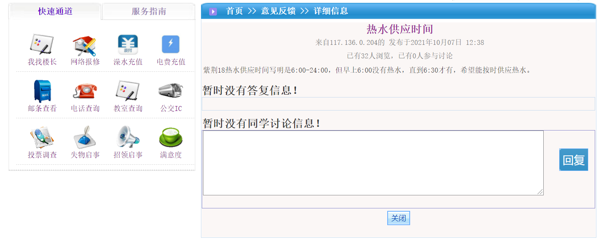
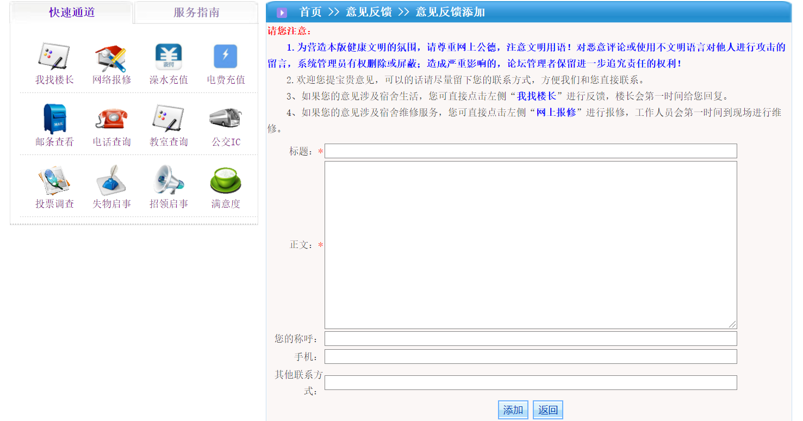

<h1 style="text-align:center">团队会议纪要</h1>

软软编程组

## 概况

+ 时间：2021年10月7日
+ 地点：北馆F2-04
+ 参加人员：周航、刘怡豪、翁兆天
+ 记录人：刘怡豪

## 讨论事项

### 一、细化

+ 甲方要求：非注册预约使用，需要提前一天审批通过或拒绝
+ 甲方要求：使用说明增加分类、筛选和搜索
+ 乙方想法：因为科协活动室的特点，反馈是必要的，管理员可以对反馈进行回复，并有权力删除反馈
+ 不仅仅是预约系统，同时注重其他方面

### 二、竞品分析报告

+ 竞品选择：

  + 清华研讨间预约系统
  
    

    > 亮点：前端设计精美，方便使用
    >
    > 不足：没有方便的反馈系统
    >
    > 思考：因为科协活动室的特点，反馈是必要的，管理员可以对反馈进行回复，并有权力删除反馈
  
  + 清华家园反馈系统
  
    
  
    
  
    > 亮点：功能完整，方便使用
    >
    > 不足：前端比较简单，有些显示内容显得冗余
    >
    > 思考：我们可以学习这个反馈系统的管理方式
  

### 三、产品定义与故事

+ 产品定位：面向清华大学机械系同学的活动室预约管理系统。

+ 产品愿景：对普通同学来说可以方便的预约使用和反馈信息，对管理员来说可以方便的发布信息、审批预约和查看回复反馈。

+ 干系人分析：

  + 机械系科协：机械系科协是项目的发起人，承担与学生科研科创活动相关工作的职能部门，具体负责安排赛事、提供科研项目信息、提供科创活动场所等工作。机械系科协希望建设活动室预约管理系统，方便学生对科协活动室的使用。
  + 机械系科协俱乐部：俱乐部工作人员主要对学生的活动室使用申请进行审批。这类人员熟悉活动室的相关工作，应该能够回复学生的反馈并管理维护活动室等。
  + 学生：学生能够方便的进行预约和反馈，并查看一些活动室设备的使用说明，主要的人群是机械系同学。

+ 用户故事地图：

+ 用户故事：

  + 作为用户，可以填写姓名、学号、邮箱、使用人数、使用时间、使用设备、使用原因预约活动室。

  + 作为用户，可以查看公告，以获取重要的信息。

  + 作为用户，可以查看使用说明，以获取某一设备的使用方法。

  + 作为用户，可以分类筛选或模糊搜索使用说明，以快速获取特定设备的使用方法。

  + 作为用户，可以选择输入姓名、学号、邮箱提交反馈。

  + 作为用户，可以查看活动室反馈及管理员的回复。

  + 作为管理员，可以使用用户名和密码登录管理端。

  + 作为管理员，可以发布或编辑公告，以告知重要事项。

  + 作为管理员，可以发布或编辑使用说明，以告知某一设备的使用方法。

  + 作为管理员，可以给使用说明添加或编辑标签，以进行分类筛选。

  + 作为管理员，可以查看、回复、并选择性删除反馈。

    > 这里需要征求甲方意见，是选择性删除反馈还是选择性展示反馈。

  + 作为管理员，可以对预约进行审批或忽略，并通过邮件形式告知用户审批通过或审批不通过及其原因。
  
  + 作为管理员，可以查看当前预约的情况（包括时间段和人数），以进行决策。

## 人员分工

+ 周航：负责竞品分析
+ 刘怡豪：负责和甲方征求确认用户故事，并整理

## 相应结果

+ 本次会议细化一些功能需求，确定竞品分析对象，并书写部分用户故事
+ 下次会议具体确认用户故事，并绘制用户故事地图

