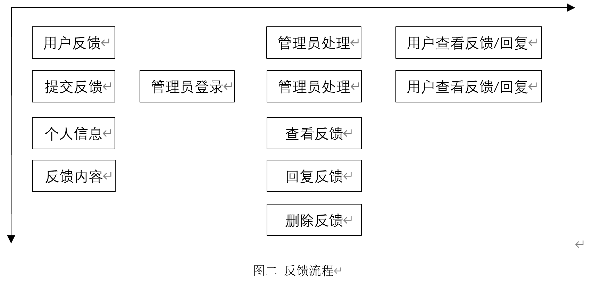

<h1 style="text-align:center">团队会议纪要</h1>

软软编程组

## 概况

+ 时间：2021年10月15日
+ 地点：北馆F2-04
+ 参加人员：周航、刘怡豪、翁兆天、唐振渊
+ 记录人：刘怡豪

## 讨论事项

### 一、细化

+ 甲方意见：管理员选择性删除反馈。

### 二、用户故事地图

## 相应结果

+ 绘制用户故事地图，完成报告

